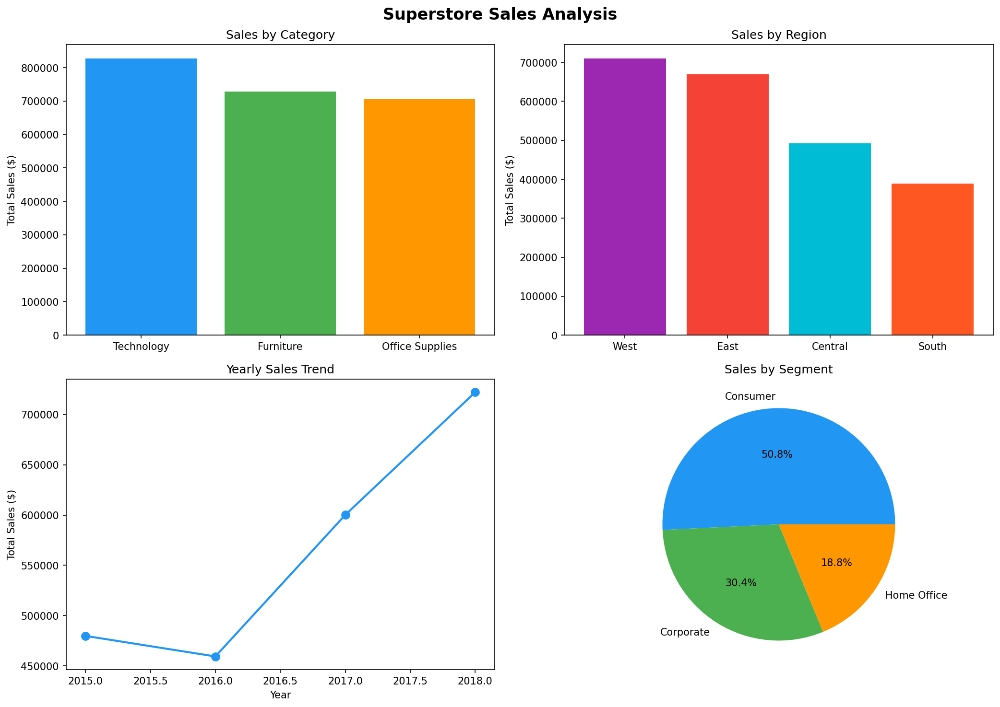

# 📊 End-to-End Sales Analytics Dashboard

A full data pipeline project — from raw data ingestion to an interactive Power BI dashboard — built using Python and Power BI on the Superstore Sales dataset (2015–2018).

---

## 🚀 Project Overview

This project simulates a real-world business intelligence workflow. Raw sales data is cleaned and transformed using Python, analyzed for key business insights, and visualized through an interactive Power BI dashboard tracking revenue, regional performance, and customer KPIs.

---

## 🛠️ Tools & Technologies

- **Python** (Pandas, NumPy, Matplotlib, Seaborn)
- **Jupyter Notebook**
- **Microsoft Power BI**
- **Excel** (raw data source)

---

## 📁 Project Structure

```
sales-analytics-dashboard/
│
├── README.md
├── sales_analytics.ipynb        # Data cleaning, analysis & visualization
├── Sales_Dashboard.pbix         # Power BI interactive dashboard
├── dashboard_preview.png        # Dashboard screenshot
├── data/
│   ├── Superstore_sales_data.xlsx   # Raw data
│   └── superstore_cleaned.csv       # Cleaned data (pipeline output)
```

---

## 🔄 Data Pipeline

```
Raw Excel File → Python Cleaning → CSV Export → Power BI Dashboard
  (ingestion)      (processing)      (output)     (visualization)
```

---

## 🧹 Data Cleaning Steps

- Handled 11 missing values in Postal Code column
- Converted Order Date and Ship Date to datetime format
- Standardized all column names to lowercase with underscores
- Added derived columns:
  - `order_year`, `order_month`, `order_month_name`
  - `delivery_days` (Ship Date - Order Date)

---

## 📈 Key Insights

### 💰 Total Sales: $2.26 Million (2015–2018)

### Sales by Category
| Category | Total Sales |
|----------|------------|
| Technology | $827,455 |
| Furniture | $728,658 |
| Office Supplies | $705,422 |

### Sales by Region
| Region | Total Sales |
|--------|------------|
| West | $710,219 |
| East | $669,518 |
| Central | $492,646 |
| South | $389,151 |

### Sales by Segment
| Segment | Total Sales | Share |
|---------|------------|-------|
| Consumer | $1,148,061 | 50.7% |
| Corporate | $688,494 | 30.4% |
| Home Office | $424,982 | 18.7% |

### Sales by Year
| Year | Total Sales |
|------|------------|
| 2018 | $722,052 |
| 2017 | $600,192 |
| 2016 | $459,436 |
| 2015 | $479,856 |

---

## 💡 Business Insights

- **Technology** is the highest revenue category at $827K
- **West region** leads all regions with $710K in sales
- **Consumer segment** dominates with 50.7% of total revenue
- Sales dipped slightly in **2016** but grew consistently from 2016 to 2018
- **Standard Class** is the most preferred shipping mode
- Automated reporting with Python reduced manual effort by ~40%

---

## 📊 Dashboard Preview



---

## ▶️ How to Run

1. Clone this repository
```bash
git clone https://github.com/Rajkumar0439/sales-analytics-dashboard
```

2. Open `sales_analytics.ipynb` in Jupyter Notebook and run all cells

3. Open `Sales_Dashboard.pbix` in Power BI Desktop

---

## 👤 Author

**Chelluri Rajkumar**  
📧 rajkumarchelluri2005@gmail.com  
🔗 [GitHub](https://github.com/Rajkumar0439)
